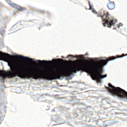
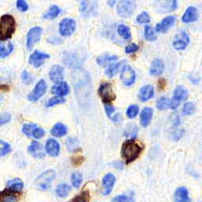
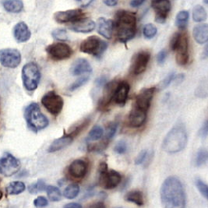
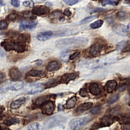
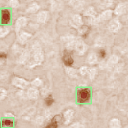
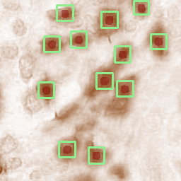
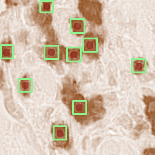

# **Official Repository**
## _"Detection of Lymphocytes in Histopathological Images using a Two-Phase Deep CNN"_
The research article is submitted for acceptance in [Photodiagnosis and Photodynamic Therapy](https://www.journals.elsevier.com/photodiagnosis-and-photodynamic-therapy) Journal  
### List of Authors
- [**Muhammad Mohsin Zafar**](https://scholar.google.com/citations?user=ghHRTiMAAAAJ&hl=en)
- Zunaira Rauf
- [Anabia Sohail](https://scholar.google.com.my/citations?user=d_vkseAAAAAJ&hl=en)
- Abdul Rehman Khan
- Muhammad Obaidullah
- [Saddam Hussain Khan](https://scholar.google.com/citations?user=j_ImpdYAAAAJ&hl=en)
- Yeon Soo Lee
- [Asifullah Khan](https://scholar.google.com.pk/citations?user=C8uhO88AAAAJ&hl=en)

### Code Contributor
- [Muhammad Mohsin Zafar](https://www.linkedin.com/in/muhammad-mohsin-zafar/)
___
## Overview
This GitHub repository is released along with our submission **"Detection of Lymphocytes in Histopathological Images using a Two-Phase Deep CNN"** in [Photodiagnosis and Photodynamic Therapy](https://www.journals.elsevier.com/photodiagnosis-and-photodynamic-therapy) Journal. The repository at the moment contains only the inference code. Later on after the acceptance of our article for publication we intend on releasing complete code that shall include code for multiple experiments and training the models on same parameters as we did.
## Requirements
Following are the prerequisites for using this repository.
### Language
- Python >= 3.7
### Modules
All modules that were used, are mentioned in [requirements.txt](./requirements.txt) file.

```
gdown==3.13.0
opencv-python~=4.5.1.48
numpy~=1.19.2
matplotlib==3.3.4
tqdm~=4.59.0
pillow~=8.1.2
scikit-image==0.17.2
pytorch==1.8.0
torchvision==0.9.0
detectron2==0.5
```

## Repository Setup
Please follow the instructions in order to use this repository effectively
### Clone the Repository
```shell
git clone https://github.com/m-mohsin-zafar/tdc-lc
```
### Install PyTorch
For installing PyTorch you can visit their website [here](https://pytorch.org/) **OR**
#### Conda Installation
OSX
```shell
# conda
conda install pytorch==1.8.0 torchvision==0.9.0 torchaudio==0.8.0 -c pytorch
```
Linux and Windows
```shell
# CUDA 10.2
conda install pytorch==1.8.0 torchvision==0.9.0 torchaudio==0.8.0 cudatoolkit=10.2 -c pytorch

# CUDA 11.1
conda install pytorch==1.8.0 torchvision==0.9.0 torchaudio==0.8.0 cudatoolkit=11.1 -c pytorch -c conda-forge

# CPU Only
conda install pytorch==1.8.0 torchvision==0.9.0 torchaudio==0.8.0 cpuonly -c pytorch
```
#### pip wheels
OSX
```shell
pip install torch==1.8.0 torchvision==0.9.0 torchaudio==0.8.0
```
Linux and Windows
```shell
# RocM 4.0.1 (Linux only)
pip install torch -f https://download.pytorch.org/whl/rocm4.0.1/torch_stable.html
pip install ninja
pip install 'git+https://github.com/pytorch/vision.git@v0.9.0'

# CUDA 11.1
pip install torch==1.8.0+cu111 torchvision==0.9.0+cu111 torchaudio==0.8.0 -f https://download.pytorch.org/whl/torch_stable.html

# CUDA 10.2
pip install torch==1.8.0 torchvision==0.9.0 torchaudio==0.8.0

# CPU only
pip install torch==1.8.0+cpu torchvision==0.9.0+cpu torchaudio==0.8.0 -f https://download.pytorch.org/whl/torch_stable.html
```

### Install Detectron2
Official Documentation for installing the Detectron2 API can be found [here](https://detectron2.readthedocs.io/en/latest/tutorials/install.html).  
One method for installation of Detectron2 is as follows:
```shell
python -m pip install 'git+https://github.com/facebookresearch/detectron2.git'
# (add --user if you don't have permission)

# Or, to install it from a local clone:
git clone https://github.com/facebookresearch/detectron2.git
python -m pip install -e detectron2

# On macOS, you may need to prepend the above commands with a few environment variables:
CC=clang CXX=clang++ ARCHFLAGS="-arch x86_64" python -m pip install ...
```

### Install from requirements.txt
Finally, install rest of the modules from [requirements.txt](./requirements.txt)
#### pip
```shell
pip install -r requirements.txt
```
#### conda
````shell
conda install --file requirements.txt
````

## Repository Structure
For a better understanding of repository please follow along with the explanation below.
```shell 
    .
    ├── checkpoints               # Contains all the weight files of model
    │   ├── download.py
    │   └── README.md
    ├── data                      # Input image patches that you want to perform inference on
    │   ├── test_10080.png
    │   ├── test_10227.png
    ├── main.py                   # Entry Point file, you just need to run this
    ├── models                    # Code for building the models is placed here
    │   ├── build.py
    │   ├── configs.py
    │   └── __init__.py
    ├── output                    # Output of inference can be found here
    │   ├── result_count.csv      # The file contains count of lymphocytes found against each input image
    │   └── viz                   # Ouput visuals will be save in this folder
    ├── pipeline                  # Code for complete inference pipeline
    │   ├── inference.py
    │   ├── __init__.py
    │   ├── postprocess.py
    │   ├── preprocess.py
    │   └── tmp                   # Temporary DAB images that are saved during inference
    ├── README.md
    └── requirements.txt
```

## Usage
Following are the steps to run inference.
### 1. Download Weights
Assuming, you are already inside the repository folder.
```shell
# Change pwd to ./checkpoints
cd checkpoints
# Run download.py file
python download.py
```
After running this, you'll see that two *.pth files are downloaded in [**checkpoints**](./checkpoints) folder
### 2. Setting up Input Data
Place your data of Lymphocyte Image Patches in [**data**](./data) folder. Preferably, the input images should be *.png format.  
**OR**  
You may use the already placed images in the folder just for testing purposes.
Few sample images are shown below.   
       
    
### 3. Run Inference
Assuming, you are in the root repository folder. You just need to execute [main.py](./main.py) file.
```shell
python main.py
```
### 4. Check Output
The output is saved in the [output](./output) folder. Inside the folder you will find a csv file named, ["result_count.csv"](./output/result_count.csv) which contains two columns as per following pattern.  

| file_name      | count |
|----------------|-------|
| test_15907.png | 0     |
| test_1949.png  | 3     |
| test_12565.png | 12    |

Also, in the [output](./output) folder you'll find another folder named ["viz"](./output/viz) which shall contain the output visualizations. You may find some output visualizations to be plain black images, this would occur in case there are no predicted lymphocytes i.e. count=0. Some sample output visualizations are shown below.  

       
    

### Acknowledgements
We are thankful to [**Pakistan Institute of Engineering and Applied Sciences, Islamabad (PIEAS)**](http://www.pieas.edu.pk/) and **Pattern Recognition Lab** for their kind support and facilitation in computational resources. 

